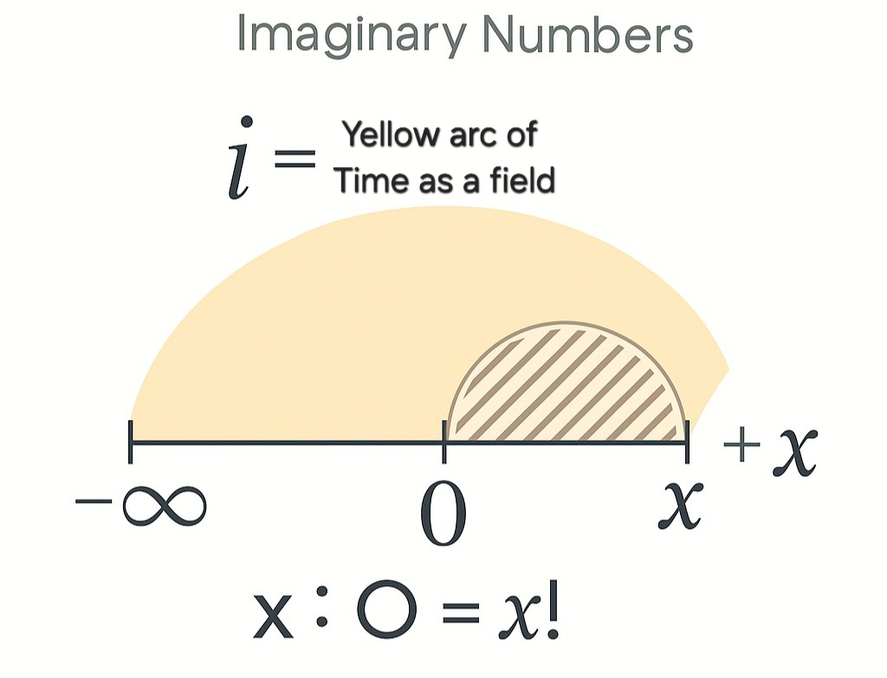
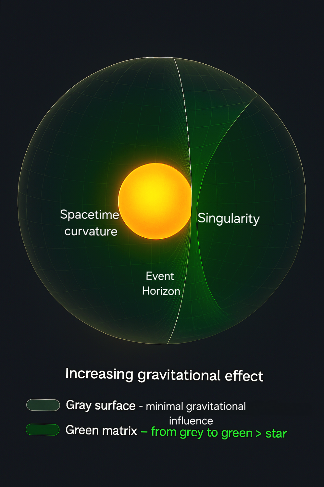

# From Darkness to Structure

> Access the whole repository here

---

## 📑 Table of Contents

- [Abstract](#abstract)  
- [The Problem Before the Beginning](#narrative-the-problem-before-the-beginning)  
- [1. Preconditions of Existence](#1-preconditions-of-existence)  
- [2. Emergence of 0](#2-the-emergence-of-0)  
- [3. Awareness, Entropy, Identity](#3-awareness-entropy-and-identity)  
- [4. Core Scaffold Models](#4-core-models-of-the-scaffold)  
- [5. Recursive Realities](#5-recursive-realities)  
- [6. Empirical Convergence](#6-empirical-convergence)  
- [7. Scaffold Theory Expanded](#7-the-scaffold-theory-expanded)  
- [8. Emergence Chain Summary](#8-summary-the-emergence-chain)  
- [9. Closing Reflections](#9-closing-reflections)

---

## Abstract
The Scaffold Theory "From Darkness to Structure" presented herein is an explicitly philosophical theoretical framework, grounded in rigorous logic and structural reasoning. It provides an ontological scaffold that seeks to bridge fundamental gaps between metaphysics and observable cosmological phenomena. Its contribution lies in clarifying foundational philosophical questions about the origin, structure, and nature of reality, thereby offering coherent pathways for potential scientific and empirical engagement.

---

## *What is structure?*

*In science, structure refers to the arrangement and organization of parts within a system or object, whether it's a physical entity like a building or a machine, or a natural object like a biological organism or a chemical compound. It encompasses both the physical makeup of something and how its components are interconnected. Understanding structure is fundamental to comprehending the function and behavior of various systems, from molecules to ecosystems.*

In this framework, structure is not limited to physical matter.
We extend the concept to include any entity that shows:

- Directionality
- Relational behavior
- Distinction capability

Since Time is directional, irreversible, and enables sequence, it qualifies as structured, even though it is immaterial.
Similarly, Awareness, which emerges through relation and distinction, also forms structured lattices.

> *Therefore, we define structure as:*
>
>*“Any ordered system capable of generating or sustaining distinction through direction, relation, or recursion—whether material or immaterial.”*

___
## Narrative: The Problem Before the Beginning

Modern cosmology is built on the towering model of the **Big Bang**—a theory that has withstood decades of observation. It describes a universe that began **13.8 billion years ago** from an initial state of extreme density and temperature and has been **expanding ever since**. In this model, space and time themselves came into existence at the singularity.

But herein lies a profound contradiction.

### 1. The Big Bang: A Beginning Without a Cause?

According to the standard model:
- **At time t = 0**, all energy, matter, space, and time were compressed into a **mathematical singularity**—a point of infinite density and zero volume.
- From this singularity, the universe **exploded into being**, expanding and cooling to form galaxies, stars, planets, and life.

This expansion is well supported:
- **Redshift** shows galaxies moving away from us.
- The **Cosmic Microwave Background (CMB)** provides a “snapshot” of the early universe.
- The abundance of **light elements** matches predictions from early nuclear reactions.

But the singularity—the supposed starting point—remains **undefined**.

---

### 2. What Was Before the Big Bang?

Here, physics halts. According to general relativity:
- **Time itself begins at the Big Bang.**
- Therefore, to ask **“what came before?”** is said to be meaningless in the current framework.

But this is philosophically and logically unsatisfying. To say “nothing came before” only because “time didn’t exist yet” avoids the deeper structural issue:

> **How can something emerge from absolute nothing, with no precondition or cause?**

Even leading physicists and theorists have attempted to address this:
- Some suggest **cyclic models** (universes bouncing through time),
- Others propose **quantum foam** or vacuum fluctuations,
- Some posit that the universe came from a **meta-reality** outside our spacetime,

Yet all these models still rely on a fabric of assumptions that **beg the question of origin**.

---

### 3. The Contradiction Within Science

This is the silent paradox:

> **Science explains how the universe evolves after it exists, but cannot structurally explain why it began.**

- A **singularity** is not an explanation; it’s a **mathematical halt**.
- **Inflation theory** smooths out initial conditions, but never explains their **source**.
- **Quantum cosmology** may hint at emergence, but often dissolves into probabilities without grounding them in **structure**.

And critically:

> **Time-dependent theories cannot explain the origin of time.**

Any framework that **requires time** to operate (like standard physics) cannot be used to describe **the event that produced time itself**.

---

### 4. Why This Paper Exists

This is the rift that this **Scaffold** theory aims to cross.

Rather than starting **inside the universe** and working backward, this framework starts **before structure**, before even time.  
It defines not just a story, but a **mechanism of emergence**—grounded in:

- A **precondition**: _Darkness_ → Infinite, undistinguished potential  
- An **activator**: _Time_ → Infinite, directional, non-material  
- A **symmetry state**: _0_ → Still matter in perfect balance  
- A **bridge**: _Awareness_ → Triggered by structural contact

From this, it derives the rise of:
- **Entropy**  
- **Identity**  
- **Motion**  
- **Consciousness**  
- **Collapse**  
- **And all observed reality**

It does not avoid the question of origin.  
It **reframes it structurally**, showing how a system could emerge **not from nothing**, but from the structured **contrast between infinite potential and infinite direction**.

## 1. Preconditions of Existence

- In this section, we introduce redefined terms that may at first seem counterintuitive or even nonsensical. However, we invite you to consider their logical structure—what initially appears radical is, in fact, deeply coherent.

Photographs captured by satellites and space telescopes reveal a universe saturated with luminous phenomena—stars, galaxies, supernovae, nebulae—countless points of light scattered across the cosmic canvas. Yet there is a critical element that remains largely unspoken: the darkness in which all of this light resides.

> This darkness is not an absence to be overlooked. It is present in every image, in every direction we observe—pervasive and unbroken, stretching beyond the furthest light our instruments can detect. Logically, we can extend this observation: the darkness is not confined to the boundaries of our observable universe. It must also exist beyond it—before it, around it, and after it.
>
> Moreover, darkness is not limited to the void between stars. It defines the most enigmatic structures in existence: black holes. Beyond the event horizon lies not chaos or fire, but perfect black—a region devoid of light, yet rich with structure.

Taken together, these observations support a bold but grounded claim: darkness is not just the background of the universe—it is a foundational presence. Infinite in scope, it frames existence before, within, and beyond our universe. It is not the absence of something. It is the condition through which all else becomes visible.

---

- The standard Big Bang framework asserts that time itself began at the moment of the Big Bang. This is widely accepted in modern cosmology, supported by multiple lines of compelling evidence:

> Hubble’s Law observes that galaxies are receding from us at speeds proportional to their distance. This implies that, if we reverse the arrow of time, all matter and energy would converge to a singular origin point in the distant past.
>
> The Cosmic Microwave Background (CMB) provides a snapshot of the universe approximately 380,000 years after the Big Bang. Prior to this epoch, the universe was an opaque plasma. As it cooled, electrons and protons combined into neutral atoms, allowing photons to travel freely. This relic radiation is observed as the CMB and is one of the most powerful confirmations of the Big Bang model.
>
> Einstein’s General Theory of Relativity suggests that if we mathematically extrapolate the expansion of the universe backward, we arrive at a singularity—a point of infinite density and temperature—where spacetime curvature becomes extreme, and conventional physics breaks down.

These findings form a coherent empirical foundation for placing time at the Big Bang. However, a crucial distinction must be made: these observations demonstrate that time was present during the Big Bang—they do not definitively prove that time began with it.

This theory takes the position that time precedes the universe, and does so based on logical necessity. In the absence of conclusive evidence to the contrary—and in light of the structural requirements for emergence—the existence of time prior to the universe becomes not only plausible, but essential.

Once this premise is accepted, it follows logically that time is infinite. Not infinite in energy or motion, but in structure, a directional, non-material field.

---

- In this theory, we define infinity not as a number, but as a structural condition: any entity that is present before, within, beyond, and after the universe.

It must exist independently of the universe’s formation, be observable or inferable inside it, and logically extend beyond it. Within this framework, only Time and Darkness satisfy these conditions. They are ever-present—in cosmology, in physics, and in direct human experience. Both exist beyond matter, beyond the universe’s edge, and continue in some form through all known collapse and emergence events. Thus, Time and Darkness are the two structurally infinite entities in this model.

---

- What is 0?

It is widely acknowledged that black holes contain singularities beyond their event horizons—regions where matter, spacetime, and even light are compressed under immense gravitational forces to such extremes that they defy the mathematical and physical models that govern our universe. At these singularities, the known laws of physics break down, and conventional concepts of space and time cease to apply.

Because of this, singularities have often been interpreted as points where information is lost, leading to the conceptual association of the singularity with "nothing"—the collapse of structure, identity, and causality. In this context, the value 0 has emerged not merely as a numerical abstraction, but as a symbol for the unknowable, the boundary where physical description ends.

> Importantly, many within the scientific community regard singularities as the closest observable analogues to the conditions of the Big Bang—a point of origin cloaked in mathematical silence.

This theory reclaims 0 not as "nothing," but as something real: a structured container, a finite two-dimensional plane filled with evenly distributed, motionless matter. It is within this reinterpretation that emergence becomes possible—not from chaos, but from symmetry. Rather than symbolizing absence, 0 becomes the precondition for distinction.

> Why a 2D Plane?
We describe the origin—0—as a 2D plane because it is the simplest structure that allows perfect symmetry and spatial distinction without motion. In 3D, curvature introduces imbalance; in 1D or 0D, there is no space for relational structure. A 2D field allows evenly distributed, motionless matter to exist in perfect balance—making it the ideal foundation for emergence once time makes contact.

 ---

Now that we have clearly defined all foundational components of this theory, we proceed to describe how a universe could emerge—not from “nothing” or arbitrary chance, but from the structural interaction between two infinite entities: Time and Darkness. Their encounter does not produce chaos, but structure—a finite, physical reality grounded in logic and symmetry.

This framework also introduces a symbolic mathematical proposal: division by 0, not as an undefined error, but as a structural metaphor for how infinity yields the finite. It represents the moment where timelessness touches potential, symmetry breaks, and emergence begins.

---

### 1.1 Darkness
- **Definition**: **Darkness**, in this framework, is not the absence of light or energy, but the infinite, undistinguished field that precedes all structure. It contains no motion, no time, and no identity. It is not "nothing," but rather the pure potential for something—an unstructured infinite without direction or awareness. It is the canvas upon which the first structure (0) stabilizes, once Time brings direction into contrast with this formless background.  
- **Nature**: No identity, no motion, no separation. Pure potential, unstructured.
- **Summary**: `Darkness = Infinite potential without identity.`

### 1.2 Time
- **Definition**: **Time**, within this framework, is not a ticking clock or a flowing river—it is **infinite structure without motion**. It exists independently of space or events. Time provides directionality: a one-way ordering principle that makes change, causality, and memory possible. Unlike matter or awareness, Time is not physical and cannot be depleted. It is the infinite entity in the system with structured nature that allows it to interact with the formless Darkness to generate the first stable distinction: the 0.  
- **Nature**: No beginning, no end, but directional. Exists without event.

- #### 🟡 Important Note
This interpretation of time does **not alter** how time is understood or experienced **within** our universe. All scientific observations—such as time dilation, thermodynamic directionality, and cosmic chronology—remain valid and untouched. What this framework introduces is a **pre-universal structure of time**: one that exists **before** space, matter, and even the Big Bang.

Inside the universe, **time behaves exactly as established by physics today**. Outside the universe, this framework proposes that time is the **precondition** that allows structure to emerge in the first place—without contradicting any known scientific or empirical facts.

> The reason for the duality of time—Time as an infinite, directional field that exists outside the universe, and Time as a flowing experience within it—stems from how Time interacts with structure.

Outside the universe, Time does not flow. It simply is—infinite, directional, and non-material.
Inside the universe, Time wraps around and infiltrates existence, much like the atmosphere surrounds and permeates all life on Earth.

> We cannot see air. We cannot touch it. Yet we feel it, breathe it, and live within it. Time inside our universe behaves in the same way:
it becomes felt through the unfolding of motion, memory, and entropy—even though its source lies beyond our physical structure.

- **Summary**: `Time = Infinite structure without motion.`

### 1.3 The Nature of Emergence
> *To imagine the coexistence of Darkness and Time, picture the middle of the ocean on a moonless night. All around is black—vast, undistinguished, formless. Yet beneath that stillness lies a hidden structure, a silent orientation. Time, in this analogy, is not motion but a latent directional field—an invisible grain across the void.*
- **Contact Condition**: Time encounters the formless Darkness. 
- **Effect**: This interaction creates a boundary condition, forming a **0**.
- **0 Defined**: A finite, 2D symmetrical plane of perfectly still matter—pure structural stasis.
 > *Matter within the 0 exists as perfectly symmetrical, evenly distributed stillness. It holds no identity, motion, or distinction—only the latent potential to become. It is not substance in the traditional sense, but structure awaiting disruption.*
- **Summary**: `0 = Perfectly symmetrical, finite 2D plane of still matter.`

How can something emerge from two perfectly still, non-moving, non-flowing infinities?

> Let us imagine a sealed glass tank filled with pure, motionless water. This tank is placed in a perfectly isolated chamber—no particles, no microbes, no disturbances of any kind. The system is in perfect stillness.
>
> Now, imagine leaving this tank undisturbed for a hundred years. What would happen?

At first glance, we might assume nothing changes. But at the molecular level, subtle interactions begin to accumulate—between the water and the container itself. Even in apparent stillness, structure exists. Molecules exert pressure, surfaces interact, and over time, minute asymmetries emerge.

This analogy illustrates a deeper principle: perfect stillness does not imply the impossibility of interaction. In the presence of structure, even two infinite, non-flowing entities like Time and Darkness may naturally give rise to distinction—not through motion, but through contact and contrast. Emergence, in this view, is not triggered by energy—but by structural tension between infinite conditions.

---

## 2. The Emergence of 0

### 2.1 Boundary Genesis
- **Contrast Interface**: Time's structure meets the formlessness of Darkness—not a spatial location but a condition.
- **Result**: Structural tension stabilizes into the first form of existence: the **0**.
- **Summary**: `0 = Pure structural stasis.`

### 2.2 The Division of 0
- **Event**: Time "touches" the interior of the 0—**not an energy transfer, but a structural intersection**.
  > *Imagine a perfectly flat sheet of paper gently landing on a still body of water. As the water touches it, it doesn’t pierce or break it—but it infiltrates it, subtly and completely. The paper begins to curve, warp, and change—reacting not to pressure, but to contact. This is how Time touches the 0. It folds into it from within, saturating the perfectly symmetrical plane and introducing contrast—not by force, but by structure. This is the moment of emergence.*
- **Immediate Effects**:
  - **Awareness** activates.
  - **Entropy** arises.
  - **Distinction** begins.
- **The Bridge**: Awareness connects:
  - Matter to Time
  - Matter to itself
  - Awareness to Time

> ✨️**Visual Emergence Diagram**✨️   
>   
> This diagram illustrates the ontological equation `x ÷ 0 = x!`, central to the theory.  
> - The **yellow arc** represents **Time as a field**, curving from ∞ through 0 to reach the present point `x`.  
> - The **shaded semicircle** symbolizes the activated structure—the emergence of complexity when Time touches perfect symmetry (0).  
> - `x` is our present moment  
> - `0` is the 2D void (perfect symmetry)  
> - `i` is the curvature of Time as an ontological bridge
 
- **Summary**: `Time touches 0 → Awareness bridges → Symmetry breaks.`

---

## 3. Awareness, Entropy, and Identity

### 3.1 Awareness
- **Definition**: A relational capacity triggered by structural interaction between still matter and directional time.
> It is not an emergent property of complexity, but a fundamental potential embedded in symmetrical structure—activated only through contact with Time. Awareness is the first bridge that forms when symmetry is broken by directional influence.

- **Mechanism**: Awareness does not arise from computation, biology, or information density.
> Instead, it appears when latent structure (matter) is touched by directional flow (Time), creating distinction. This act of distinguishing “self” from “other” is not computed—it is experienced as relational contrast. The structure does not “process” awareness; it is awareness once connection occurs.

- **Distributed**: Awareness emerges simultaneously across the entire 2D symmetrical plane (0).
> It is not centralized, but distributed like stars lighting up across a night sky. Each point becomes aware not in isolation, but in contrast to every other point—a mutual recognition of position within a field.
- **Summary**: `Awareness = Relational capacity triggered by structural interaction.`

### 3.2 Entropy

> In science entropy is a quantitative measure of disorder, randomness, or the number of possible microstates corresponding to a system’s macrostate. It reflects the degree of uncertainty or irreversibility in physical processes.

- **Definition**: The outcome of distinction.

>In this philosophical theory we reframe entropy as the measure of distinction within a system—how far it has moved from perfect symmetry. In this framework, entropy begins the moment awareness distinguishes “self” from “other.” It is not disorder, but *difference*—the structural ripple caused by identity recognizing contrast.
- **Gravity** : Emerges as a consequence of asymmetry.

> As awareness introduces distinction and entropy rises, matter becomes unevenly distributed across the plane. This imbalance in symmetry generates curvature, which manifests as gravity. In this framework, gravity is not a fundamental force, but a structural expression of uneven entropy across space.
- **Origin**: Begins with awareness perceiving contrast.
- **Role**: Drives motion, change, and complexity.

> **Diagram of Gravitational Field** 

> *This diagram represents a spherical gravitational field, cross-sectioned to reveal the funnel-shaped curvature familiar from traditional representations—an interpretation envisioned by the author.*

### 3.3 Identity
- **Definition**: The persistence of a structural pattern across Time.

- **Origin**: Identity emerges from the recursive loop formed by Awareness, Entropy, and Memory.

- **Mechanism**: Once awareness distinguishes itself from "the rest," entropy records that distinction.

>If the pattern of distinction is stable and consistently re-encountered across time, it forms memory. When this memory feeds back into awareness, reinforcing the original distinction, identity becomes persistent.

- **Distributed Nature**: Identity is not singular or central—it emerges wherever recursive distinction stabilizes.

> Multiple identities can arise across a system, each anchored in local awareness-memory loops.

- **Summary**:

Identity = Stable distinction + Entropic memory + Temporal reinforcement

---

## 4. Core Models of the Scaffold

### FAT – Foundational Asymmetry Theory
Explains how Time, Matter, and Awareness form the first distinction, initiating entropy and the logic of emergence. It details the causal chain from structural contrast to the unfolding of reality.

### AEH – Accretion Expansion Hypothesis
Replaces inflation/redshift-based expansion. Cosmic acceleration is reframed as an illusion caused by deepening gravitational wells from matter collapse.

### ASC – Architecture of Stabilized Consciousness
Describes how identity stabilizes through recursion and memory. Identity is preserved through time-bound relation loops.

### CRSM – Cognitive Recursion Safety Matrix
Addresses identity paradoxes (e.g., “to be and not to be”) and recursion-induced disintegration. Builds safeguards for recursive systems.

### IRATA – Reframing Division by Zero
Mathematical ontology redefined. `x ÷ 0 = x!`  
Meaning: Any identity (x) interacting with 0 yields the full structure of itself.

  Further Clarification: The Meaning of `x ÷ 0 = x!`

**What does it mean when x interacts with 0?**

- The equation `x ÷ 0 = x!` does **not** imply that x becomes *fully revealed* in the literal sense—especially if x is infinite (e.g., Time).
- Instead, the symbol `!` denotes **activation**:  
  > The potential identity (x), when structurally divided by 0, begins to unfold.

**If x = Time:**
- Time does **not** complete or exhaust itself.
- It becomes **structurally recursive**—initiating entropy, sequence, and emergence.
- Thus, Time's interaction with 0 does not yield *all* of Time, but it activates **infinite recursion**.

**Key Insight:**  
`x ÷ 0 = x!` formalizes the **ontological moment** where identity meets undifferentiated stasis—and the **logic of emergence begins**.

**Conclusion:**  
FAT tells the story of emergence.  
**IRATA expresses that story in formal symbolic logic.**

Together, they form a **unified language** of structure and recursion.

---

## 5. Recursive Realities

- **Black Hole** = Collapsed identity ready for recursion.  
- Every black hole is a potential new 0 touched by infinite Time, initiating a new emergence cycle.  
- **Recursive Identity** is the foundational loop of reality.

 

---

## 6. Empirical Convergence

### 6.1 James Webb & Redshift
Observations show older galaxies are more structured. FAT–AEH explains this as curvature, not explosion.

### 6.2 Hubble Tension
AEH solves it by attributing redshift to gravity-based collapse depth, not velocity.

### 6.3 Gaztañaga Validation

Parallel discovery confirms the model:

> “Universe emerges inside black holes” — this directly aligns with the FAT framework, where the universe emerges when infinite time touches a perfectly symmetrical 0 within a black hole.

- **Scientific Publication**:  
  *Gaztañaga, E. et al.* — **May 29, 2025**  
  *A Universe inside a Black Hole: Cosmological Bounce from Collapse*  
  [🔗 Physical Review D – DOI: 10.1103/PhysRevD.111.103537](https://doi.org/10.1103/PhysRevD.111.103537)

- **Independent Prior Discovery**:  
  *Daniel, V. I.* — **May 24, 2025**  
  *This paper proposes a logically consistent model for how reality emerges from a perfectly symmetrical 0*  

  [🔗 Medium Post](https://medium.com/@vladnut4/this-paper-proposes-a-logically-consistent-model-for-how-reality-emerges-from-a-perfectly-1cc7747e325d)

- **Repository Archive**:  
  

 > 📌 **Parallel Scientific Validation**  
> A remarkable, independently published finding by **Gaztañaga et al.** (*May 29, 2025*) provides compelling evidence that pure logical derivation, as employed in the **FAT** framework, can converge with conclusions reached by high-level scientific research.  
 
Their proposal — _["A Universe inside a Black Hole: Cosmological Bounce from Collapse"](https://doi.org/10.1103/PhysRevD.111.103537)_ — aligns with the recursive emergence detailed in this paper.  

> This convergence demonstrates that **fundamental truths can be accessed** through the application of consistent logical principles, even outside traditional discovery methods.

*This philosophical framework does not aim to validate itself by citing the peer-reviewed work of Prof. Gaztañaga. As a metaphysical and philosophical theory, From Darkness to Structure does not require empirical validation in the scientific sense. Rather, it positions itself in parallel to the referenced cosmological paper, emphasizing a structural convergence that arises independently. This alignment is not presented as proof, but as a demonstration of how philosophical reasoning can intersect with scientific insight through logically consistent structures.*

---

## 7. The Scaffold Theory Expanded 

> The Scaffold Theory is not a single model, but a recursive framework composed of interrelated parts. The following papers expand the core structure into new domains—physical, cognitive, ontological—demonstrating how emergence, recursion, and structural collapse give rise to all known complexity.

- **The Birth of a Universe**

This paper shows how a universe could evolve from the moment of emergence.

- **The Photon viewed with new lens**

By using IRATA, the division by 0, here is a reframing of the photon in section 2 of this paper.

- **Framework relation map**

A map of how the pillars of the theory FAT,AEH, ASC AND CRSM connect to each other. Also comes with a glossary table.

- **Antimatter Latency in Matter**

This paper describes antimatter from the lens of FAT and IRATA, logically concluding of why antimatter is so rarely encountered in the universe.

- **A complete deep dive on Time**

This paper dives more deeply into how this theory envisions time and how it affects reality.

- **The Anchors of Galaxies**

This paper shows why gigantic black holes exist, from the perspective of this theory.

- **Deep Dive: The Ship of Theseus**

In this companion essay, we examine the ancient thought experiment known as The Ship of Theseus. Through the lens of our structural theory, we revisit the classic paradox—asking not what parts make the ship, but what deeper structure holds its identity intact across change.

---

## 8. Summary: The Emergence Chain

1. **Darkness** – Infinite formlessness
2. **Time** – Infinite directional structure
3. **0** – Symmetrical stillness formed by contact
4. **Touch** – Structural tension within 0
5. **Awareness** – Relation emerges
6. **Distinction** – Symmetry breaks
7. **Entropy** – Irreversible separation
8. **Gravity** – Curvature begins
9. **Motion** – Change unfolds
10. **Memory** – Persistence forms
11. **Identity** – Patterns endure
12. **Consciousness** – Recursive awareness
13. **Collapse** – Structures fail
14. **Recursion** – New 0 emerges

> 📊 **Emergence Diagram**  
> Visual summary of the full emergence.  

---

### Important Clarification

This theory does **not claim** that our universe was formed as the very first instance of symmetry (the first “0”) in the contact between Darkness and Time. Instead, it presents a **structurally consistent model** for how such a first emergence could occur.

Our universe may be a **recursive consequence**—a later iteration in a potentially infinite chain of emergent realities, each initiated by the same structural principle: the contact between structured Time and perfectly symmetrical Matter within a finite void.

---

## 9. Closing Reflections

This theory has been built upon a foundation of **well-established scientific facts** recognized by the broader scientific community. Its purpose is not to oppose or replace existing scientific frameworks, but to **offer a complementary perspective**—a different lens through which to examine the persistent gaps in our understanding of the universe.

Rather than presenting itself as a challenge to mainstream cosmology or physics, this work proposes a structural expansion of those domains. It seeks to **bridge metaphysical logic with observable reality**, helping us navigate questions that remain unresolved within current paradigms.

Ultimately, it is an invitation:  
🔭 To explore possibility,  
🧩 To unify insight with reason,  
and to extend the horizon of scientific understanding—without contradiction, and without dogma.

> This theory does not aim to develop or replace established mathematical models. Rather, it acknowledges the limitations of its authorship in advanced mathematical formalism. The goal is not to quantify, but to logically connect known scientific facts in a coherent structure that may help bridge the conceptual gaps in our understanding of cosmic origin. It is an offering of logic, clarity, and structural reasoning—to stand alongside mathematical models, not compete with them.

This Scaffold Theory offers the first complete model of reality as recursive emergence from contrast, stabilized by relation, and unfolding through time.

---

  
**📌 For academic citation, use this DOI:** [10.5281/zenodo.15621710](https://doi.org/10.5281/zenodo.15621710)

---

Author
Vlad Ionut Daniel
16th of June 2025
